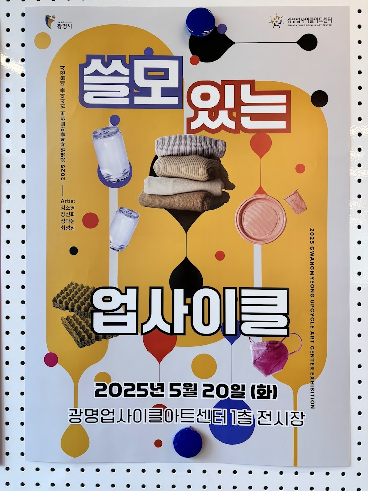

# eco-art-project
에코 포트폴리오 : AI로 그리는, 환경에 관한 나의 이야기

# 프로젝트: (여기에 우리 작품의 제목을 적어주세요)

### 2025 에코아트 만들기 수업 / 팀: (팀 이름) / 팀원: (팀원 이름)


---

## 1. 작품 소개
> 우리 작품이 어떤 환경 문제를 다루고 있는지, 어떤 메시지를 전달하고 싶은지 자유롭게 설명해주세요.
> (예: 저희는 버려지는 플라스틱 쓰레기 문제의 심각성을 알리기 위해...)

## 2. 제작 과정
### 아이디어 스케치
(여기에 아이디어 스케치 사진을 넣어주세요)

### 프로토타이핑 및 작품 제작
(여기에 작품을 만드는 과정 사진들을 2~3장 넣어주세요)


## 3. 작품 상세 설명
### 회로도
(손으로 그린 회로도나 Fritzing으로 그린 회로도 사진을 넣어주세요)


### 아두이노 코드
[코드링크](https://github.com/zzeromin/eco-art-project/)

```cpp
// 여기에 우리 팀이 작성한 최종 아두이노 코드를 붙여넣어 주세요.
void setup() {
  // ...
}

void loop() {
  // ...
}
```

### 동영상

[](https://youtube.com/shorts/9K9Y-W1CK3E?si=MWaWgp3jyDSlz0Xn) 

## 느낀점

이번 프로젝트를 통해 배우고 느낀 점을 자유롭게 이야기해주세요.
(예: 코딩이 생각보다 어렵지 않았어요. 작은 아이디어가 실제 작품이 되는 과정이 신기했어요.)
