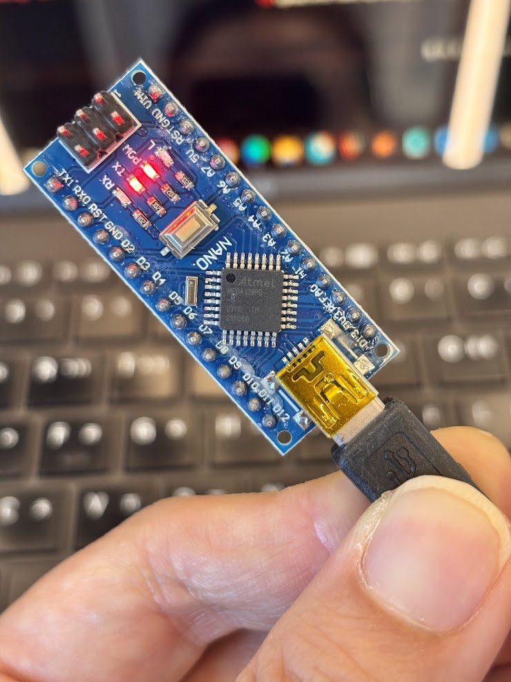
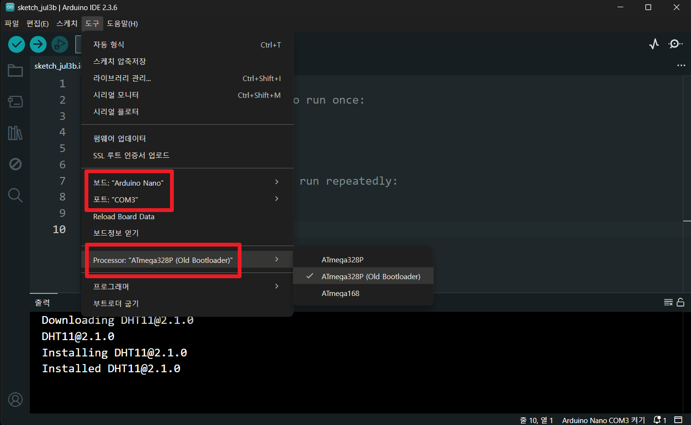
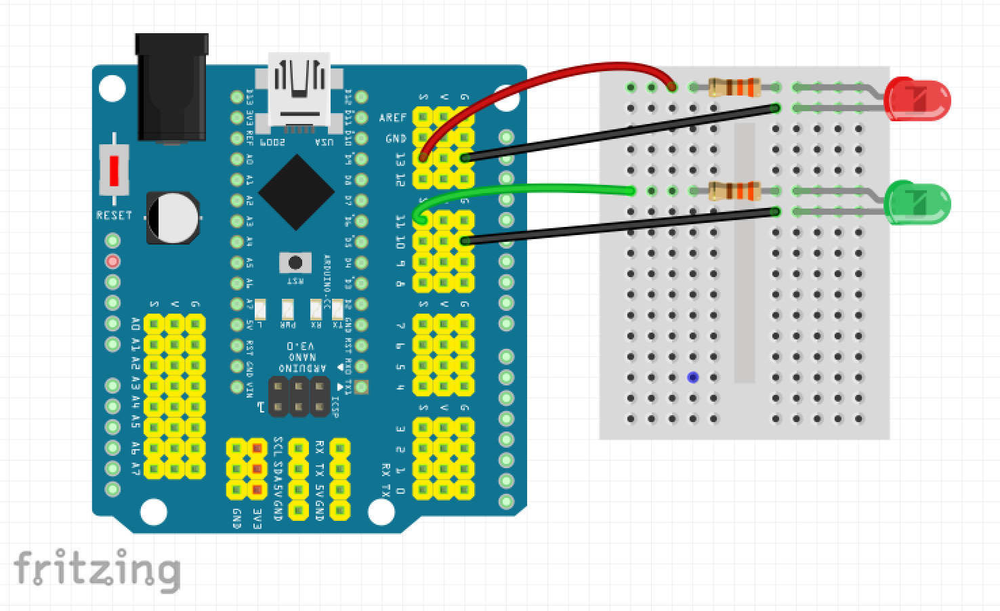

# 🌱 에코아트 프로젝트: AI로 그리는, 환경에 관한 나의 이야기


## 📖 프로젝트 개요
- **제작자**: Plumkit
- **제작일**: 2025-07-16
- **소개**
> 우리 작품이 어떤 환경 문제를 다루고 있는지, 어떤 메시지를 전달하고 싶은지 자유롭게 설명해주세요.
> (예: 저희는 버려지는 플라스틱 쓰레기 문제의 심각성을 알리기 위해...)


## 📦 사용 재료
- 아두이노, 온도센서, LED, 브레드보드
- 페트병, 그림 도안 등


## 🔧 제작 과정


### 1단계: 아이디어 스케치

- 아이디어 설명
- 예상 완성도

### 2단계: 재료 준비


- 재료 수집 과정
- 재료 선택 이유

### 3단계: 제작 과정




- 단계별 제작 설명
- 어려웠던 점과 해결 방법

### 아두이노 코드
[코드링크](https://github.com/zzeromin/eco-art-project/)

```cpp
// 여기에 우리 팀이 작성한 최종 아두이노 코드를 붙여넣어 주세요.
void setup() {
  // ...
}

void loop() {
  // ...
}
```

### 4단계: 완성품


**🎯 완성품 소개 영상**
[](https://www.youtube.com/shorts/9K9Y-W1CK3E) 


## 💭 제작 후기
### 느낀점
- 이번 프로젝트를 통해 배우고 느낀 점을 자유롭게 이야기해주세요.
(예: 코딩이 생각보다 어렵지 않았어요. 작은 아이디어가 실제 작품이 되는 과정이 신기했어요.)

### 개선할 점
- 


## 🌍 환경적 의미
- 이 작품이 환경에 미치는 긍정적 영향
- 사용한 재활용 재료가 환경에 미치는 의미
- 앞으로의 환경 보호 다짐 등 자유롭게 작성하세요.


## 📚참고 자료
- [환경 관련 웹사이트](링크)
- [참고한 에코아트 작품](링크)


## 🏷️ 태그
#에코아트 #재활용 #환경보호 #DIY #창의활동

---

> 이 프로젝트는 환경 보호와 창의적 사고를 위한 교육 목적으로 제작되었습니다.
